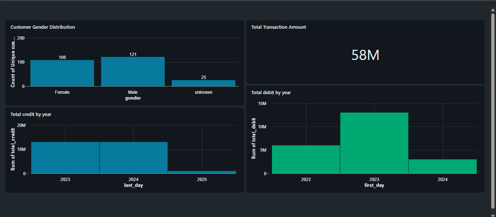

# databricks-bank-data-pipeline
Real-time data engineering project on Databricks: banking dataset processed with Medallion Architecture (Landing → Bronze → Silver → Gold), incremental loads (2023–2024), CDC, SCD Type 1 &amp; 2, and real-time dashboards.

# 🏦 Real-Time Banking Data Pipeline with Databricks

## 📌 Project Overview
This project demonstrates an **end-to-end real-time data engineering pipeline** using **Databricks Delta Live Tables (DLT)** and the **Medallion Architecture** (Landing → Bronze → Silver → Gold).  

The pipeline ingests **banking data** (Customers & Account Transactions) from **2023**, then incrementally loads **2024 data**.  
It applies **data quality checks, transformations, CDC (Change Data Capture), and SCD (Slowly Changing Dimensions Type 1 & 2)** before producing curated Gold tables for analytics and powering a **real-time dashboard**.

---

## ⚙️ Tech Stack
- **Databricks** (Delta Live Tables, Dashboards)  
- **Delta Lake**  
- **PySpark & SQL**  
- **Streaming Tables** (Auto Loader)  
- **CDC & SCD (Type 1 & Type 2)**  

---

## 🛠️ Pipeline Flow

### 1. Landing Layer
- Ingest **customer** and **account_transaction** data from CSV files.  
- 2023 data loaded fully → 2024 data ingested **incrementally**.  
- Data converted into **streaming mode** with schema definition.  

### 2. Bronze Layer
- Applied **data quality checks** (validations, deduplication, schema enforcement).  
- Handled **exceptions and bad records**.  
- Maintained **streaming tables** for continuous ingestion.  

### 3. Silver Layer
- Transformed clean data into analytics-ready models.  
- Implemented:  
  - `apply_changes()` → Customer data (SCD Type 1 & Type 2).  
  - `auto_cdc()` → Account Transactions data (real-time CDC).  
- Created **views** for downstream consumption.  

### 4. Gold Layer
- Aggregated **customer & transaction data**.  
- Joined both datasets to generate business KPIs.  
- Enabled **real-time analytics** for dashboards.  

---

## 📊 Outputs
- ✅ Incremental ingestion (2023 full load → 2024 incremental).  
- ✅ **Streaming tables** at each Medallion stage.  
- ✅ **SCD1 (overwrite)** and **SCD2 (history tracking)** applied on customer data.  
- ✅ **CDC** applied on account transactions (insert/update/delete).  
- ✅ **Gold tables** powering real-time dashboards.  

---

## 📈 Dashboard Example
Real-time dashboard created in Databricks for analytics such as:  
- Customer activity trends  
- Account balances over time  
- Transaction KPIs  

---

## 🚀 Key Learnings
- Designing pipelines with **Medallion Architecture** in Databricks.  
- Handling **real-time data ingestion** with Auto Loader & DLT.  
- Applying **CDC + SCD1 + SCD2** in a streaming context.  
- Automating ETL workflows with triggers.  
- Delivering **real-time business insights** via dashboards.  

---

